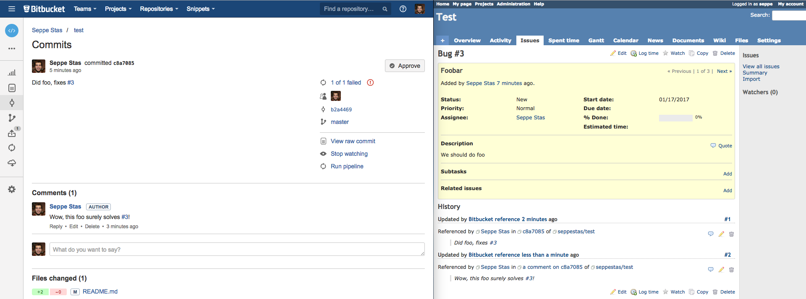
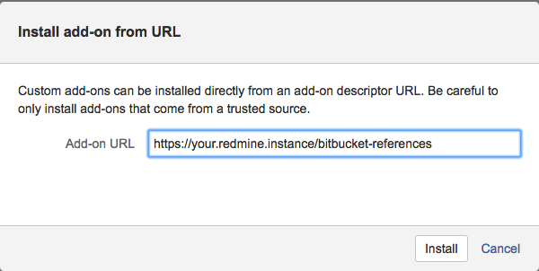

Bitbucket reference Redmine
===========================

Reference [Redmine][redmine] issues in [Bitbucket][bitbucket].



This is both a [Redmine plugin][redmine-plugin] and an
[Atlassian Connect for Bitbucket Cloud][bitbucket-addon] compatible add-on.

You can find it on the [Attlassian marketplace][Attlassian marketplace] and the
[Redmine plugins directory][Redmine plugins].

Features
--------

When installing this addon in Bitbucket it registers:

- A [Bitbucket linker][linkers] that makes Bitbucket turn references to issues
  (using a specified regex) into links to the issue in Redmine;
- [Bitbucket webhooks][webhooks] for pushes, commit comments, pull requests and
  pull request comments. These webhooks get handled in the Redmine plugin,
  creating a journal entry for the issue containing the commit message or comment and
  useful links and meta-data.

Since the linker and webhooks are registered using an addon they automatically
work for all repositories of the user / team for whom the addon is installed.

Limitations
-----------

- Currently the regex is hardcoded to `(?<!&)#([0-9]+)`, meaning issues have to
  be referenced using `#<issue number>`. The negative lookahead is a workaround
  for [Bitbucket bug #13642][bitbucket-links-regex-matches-on-html] (issue #1).
- Currently only up to 5 commits per push are supported because of a limitation
  in [Bitbucket's push webhook][push-webhook] (issue #2).
- Issue references in pull request edits, pull request comment edits or commit
  comment edits as well as references to issues belonging to closed projects
  will not cause Redmine journals to be updated or added.

Installation
------------

### First, install the plugin in Redmine

From your [Redmine installation][redmine-installation] directory:

- Download or clone this repo

    ```
    mkdir plugins/bitbucket_reference_redmine
    wget -qO - https://bitbucket.org/productize/bitbucket_reference_redmine/get/master.tar.bz2 | tar jx --strip-components=1 -C plugins/bitbucket_reference_redmine
    ```
    
    or
    
    ```
    git clone https://bitbucket.org/productize/bitbucket_reference_redmine.git plugins/bitbucket_reference_redmine
    ```

- Install the plugin's dependencies

    ```
    bundle install
    ```

- Run the migrations

    ```
    bundle exec rake redmine:plugins:migrate
    ```

- Restart Redmine

    E.g, if Redmine is installed as an Apache 2 passenger:
    
    ```
    sudo service apache2 restart
    ```
    
    or if Redmine has it's own service:
    
    ```
    sudo service redmine restart
    ```

### Next, install the addon in your Bitbucket user/team:

- Navigate to https://bitbucket.org/account/user/{your-user-or-team-name}/addon-management
- Click "Install add-on from URL"
- Enter {base URL of your Redmine installation}/bitbucket-references:

  

- Click "Install"
- Click "Grant access"
- You will now get redirected to the plugin's settings page in your Redmine
  instance. This may require you to log in.
- Click "Allow" on the Bitbucket connection you just added.

Notes
-----

- The Bitbucket Connect system requires your Redmine installation to use HTTPS.
- To add a second Bitbucket account make sure the "Allow new Bitbucket
  connections" option is enabled on the plugin's configuration page.

[redmine]: http://www.redmine.org/
[bitbucket]: https://bitbucket.org
[redmine-plugin]: http://www.redmine.org/projects/redmine/wiki/Plugins
[bitbucket-addon]: https://developer.atlassian.com/bitbucket/guides/introduction.html
[linkers]: https://developer.atlassian.com/bitbucket/modules/linkers.html
[webhooks]: https://confluence.atlassian.com/bitbucket/manage-webhooks-735643732.html
[bitbucket-links-regex-matches-on-html]: https://bitbucket.org/site/master/issues/13642/bitbucket-links-regex-matches-on-html
[push-webhook]: https://confluence.atlassian.com/bitbucket/event-payloads-740262817.html#EventPayloads-Push
[redmine-installation]: http://www.redmine.org/projects/redmine/wiki/redmineinstall)
[Attlassian marketplace]:https://marketplace.atlassian.com/plugins/bitbucket-reference-redmine/cloud/overview
[Redmine plugins]: http://www.redmine.org/plugins/bitbucket_reference_redmine
